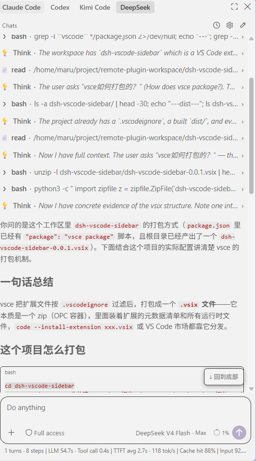
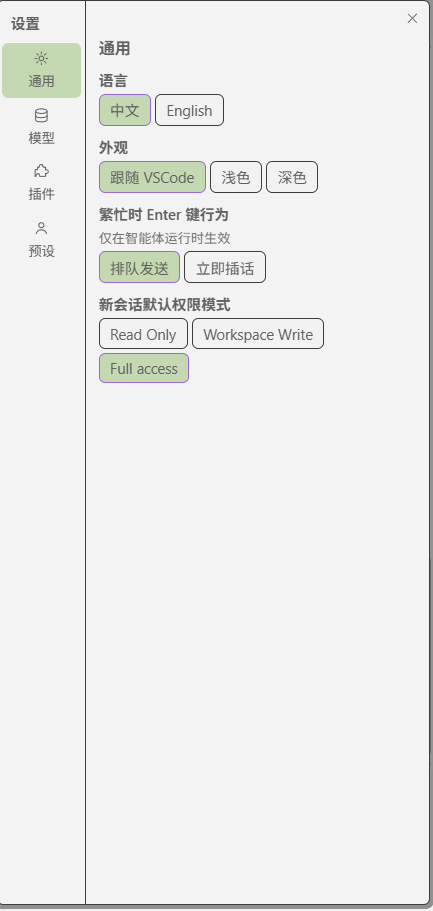

# dsh-vscode-sidebar

DeepSeek harness（dsh）的 VSCode 侧边栏插件。插件只做前端界面，后端能力全部复用本机 dsh web host（loopback，无实例时自动拉起）。

vibe coded by **kimi k3 & GPT 5.6 & deepseek v4**.
## 界面展示

<table>
  <tr>
    <td></td>
    <td></td>
  </tr>
  <tr>
    <td align="center">对话页面</td>
    <td align="center">设置页面右图说明</td>
  </tr>
</table>

## 核心原理
```text
[VSCode Webview: React UI（会话/对话/审批/设置）]
        │ postMessage 桥协议 (shared/bridge.ts)
        ▼
[Bridge + SidebarProvider]  ◄── 广播 mux/host 事件帧、host-status
        │ 透传 rpc / respond
        ▼
[DshClient（extension 进程, Node ≥22）]
   │                              │                         │
   │ POST /api/<method>          │ POST /api/respond       │ WS /api/events.mux
   │ (session.create 等 unary)   │ (审批/提问应答)         │ + /api/events.host
   ▼                              ▼                         ▼
[HostManager: 探测 127.0.0.1:3080..3089 → 无则 spawn `dsh web`]  (只连 loopback)
        │ spawn / 复用 / 版本检查
        ▼
[dsh web host 进程]
  [webserver: createServer + 'upgrade' 分发]  ── /api/* 请求、WS 升级
        │
  [client-connection: isTrustedApiRequest 信任门 → toFetchHandler / WebSocketDownlinks]
        │
  [ApiProxy (apiproxy 包)]
    ├─ unary: session.*/workspace.*/settings.*/preset.*/llm.* → 执行业务
    ├─ respond: 按 rpcId 结算 pending 的审批/提问
    └─ events: 订阅 ctx 事件总线，把 session/event 等转成 MuxFrame/HostFrame
        │ ctx.on('session/event') 等
        ▼
[Session / Agent / workspace 注册表（harness 核心）]
```
## 安装
### dsh插件
确保dsh已经安装
`npx @deepseek-ai/dsh web`
### vscode 插件
[vscode 插件](https://marketplace.visualstudio.com/items?itemName=XuRongsheng.dsh-vscode-sidebar)
### Github repo
[Github repo](https://github.com/MmMmaru/dsh-vscode-sidebar)

## 功能支持

### 会话管理（上层栏）

- 会话列表按当前 VSCode 工程目录过滤，只显示本项目的会话；列表项含状态点、标题、相对时间，超出显示 "View all (N)"
- 历史下拉：时钟按钮 / View all 展开带搜索的浮层，点外部或 Esc 收起
- 状态点三态：绿=运行中，蓝=执行完未读（选中会话即清除为灰=已读）；审批/提问等待时琥珀色，优先级最高
- 运行计数：有后台会话运行时，历史按钮变为旋转圈 + 中心数字（运行中数量），点击仍展开历史下拉
- 会话操作：重命名、删除、Fork（从已完成回合分叉）
- 空会话复用：当前会话仍为空时点"新建对话"直接复用，不产生重复空会话
- 进入会话后列表收起为 Chats 头部，历史走时钟下拉

### 对话区（中间层）

- Assistant 回复 Markdown 流式渲染：流式期间代码块/公式按纯文本显示，回合结束后完整渲染（代码块带复制按钮）
- Think 推理块折叠行：单行图标 + 摘要，流式中摘要跟随最新一行，点击展开全文
- 工具调用默认折叠为单行（图标 + 工具名 + 摘要，错误红点），点击展开为卡片：Bash 终端卡 / Edit·Write diff 卡 / Read 行号文件卡 / Grep·Glob 搜索结果卡 / Web 搜索引用卡；subagent 工具调用递归缩进
- 特殊行：上下文注入折叠行、历史压缩标记、模型重试行、回合错误、token 上限提示、运行状态行（"Deep diving..."）
- 消息操作：assistant 消息末尾复制（带已复制反馈）+ fork 分支按钮（streaming 时隐藏）
- 审批 / ask-user 提问 / Plan 评审浮层整块接管输入区：审批含理由、待执行命令与 Refuse / Allow once；提问含单选/多选、自定义输入、分页与 Skip / Submit；Plan 含完整 Markdown 渲染与 Chat about it / Refuse / Approve
- 滚动：贴底自动跟随、上翻解除、离开底部浮现"回到底部"按钮、历史分页顶部 "Load older"

### 输入区（下层栏 Composer）

- 文本框多行自动增高，Enter 发送 / Shift+Enter 换行；随时可输入，无会话时发送自动建会话
- 权限芯片：Read Only / Workspace Write / Full access（选 Full access 弹风险确认）；启动时同步 host 端默认权限，新建会话重置为已保存默认
- 模型选择器：两级菜单（模型按 provider 分组 + reasoning effort 档位）；"记住上次模型"由 host 端实现（新会话自动带回），无会话首页通过 host.describe 预选默认模型，无会话时的选择暂存、建会话后自动应用
- 上下文用量环（ContextMeter）：按 contextWindow 计算占用，环旁带百分比文本，缺数据不渲染
- 统计行（StatsLine）：输入卡片下方小字——turns/steps、LLM/Tool 耗时、TTFT、tok/s、缓存命中、Input/Output token（数据源为 host 投影帧）
- 消息队列（QueueDock）：运行中发送的消息入队，显示在输入框上方，可编辑/删除/立即插话（Steer）
- Todo 面板（TodoPanel）：agent 使用 todo 工具时任务清单显示在输入框上方
- 主按钮：静止=发送箭头，运行中=方块停止（重装/切换会话后仍按会话 running 状态正确显示）
- 附件：`+` 按钮 / 拖拽 / 粘贴图片，缩略图 rail 可预览、可移除，超限整批拒绝

### SubagentDock 管理栏

- 列出当前会话的子代理；continuable 且运行中的子代理显示"停止"按钮（subagent.interrupt）
- one-shot / 已结束的子代理只读展示
- 后台任务（session/jobs 帧）渲染只读状态行——协议不支持手动停止，停止权属模型侧 job_kill

### 设置页

- **通用**：Agent 预设、新会话默认权限模式、语言、外观（跟随 VSCode / 浅色 / 深色）、繁忙时 Enter 行为
- **模型**：provider 列表（已配置/未配置状态）、编辑卡（API key、base URL）、添加/删除提供方；凭据写入 harness 凭据存储
- **插件**：插件设置与清单
- **Agent 预设**：预设列表管理

### 后端接入与 workspace 归属

- 连接本机 dsh Web Host（loopback）：HTTP RPC + mux / host 两条 WebSocket，断线自动重连；无实例时自动拉起，用户无感
- 会话归属：以当前 VSCode 工程根目录（cwd）归属会话；新建会话先调 workspace.create（按插件根目录幂等归属）再 session.create，插件会话在 dsh 网页端归入对应 Workspace 统一管理（老 host 不支持时回退 cwd 创建）
- 协议类型 vendored 自 deepseek-harness（见 `src/extension/protocol/`）

## 从源码安装

```bash
npm install
npm run package   # 产出 VSIX（dist/*.vsix）
code --install-extension dist/dsh-vscode-sidebar-*.vsix
```

或在 VSCode 中"扩展"面板 → `...` → "从 VSIX 安装"。本地使用，不发布插件市场。

## 测试

```bash
npm test          # 单元测试（node:test，协议/store/扩展宿主纯逻辑）
npm run test:e2e  # Playwright 浏览器 E2E（真实扩展宿主代码 + 真实隔离 dsh host）
```

E2E（`tests/e2e/`）：真实扩展宿主代码（Bridge/DshClient/HostManager，vscode 模块经 esbuild alias 替换为 stub）跑在 Node，
Playwright 页面加载真实构建产物 `media/main.js`，页面与 Node 宿主经 WebSocket 桥接；每个运行自 spawn 一个隔离 dsh host
（`$DSH_HOME` 临时目录 + 拷贝用户 settings/credentials，端口 3200 起探测空闲，结束自清理；**永不触碰 3080**）。
覆盖五条 TODO 修复回归（IDE 插入 / 提问后台重放 / 跨工作区隔离 / 发送置顶）+ 真实模型对话闭环（结构断言）。

## 待支持
目前正在让插件美观易用，无限接近与codex extention(bushi)
欢迎issue & PR

[TODO](docs/TODO.md)