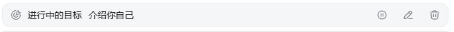

### 前端
- [x] Goal 条（已接入：进行中/已暂停/已受阻 + 暂停/恢复/编辑/清除）
  

### 功能
- [] /命令支持，对话框内输入斜杠后提示命令输入  
支持技能名、/goal、/compact、/plan
- [] subagent管理  
我觉得这个后台运行的时候至少要有个提示，前台的话就无所谓吧。后面再支持一下前台的美观优化。
- [] 后端模型真实配置，目前好像不work

- [] 目前session管理栏目里...点击之后选项出现在session下面，我希望出现在旁边。

- [] 插件可配置
参考web端设计

- [] GIF展示
动态演示

- [] 模式动态切换
调研dsh是否支持动态切换？

- [] 任务完成提示
session管理内标点提示
支持音频提示

- [x] ide内容插入
（已完成：① 发送时自动注入——选中代码 / 无选区带当前文件路径；② 注入内容对用户隐藏，对话只显示 `ide：…` 提示行；③ 输入区 `</>` 上下文开关（持久化，默认开）；④ 手动命令 `dsh.insertSelection` / `dsh.insertActiveFile`）

- [] ecs打断支持

- [ ] 英文切换支持

- [] 图片上传预览失败

- [] 对话框内分点支持，在右侧加入一个bar，展示用户对话开始点。鼠标悬浮展示对话内容
### bug
- [x] 放到后台的时候，再切回来发现askuserquestion失效。
（webview 隐藏即被销毁；扩展侧 OverlayRetention 常驻保留待应答帧，init 重放 + 按会话记录 overlay，切回自动选中并恢复接管面板）
成功
- [x] 跨工作区会话混淆了，按照vscode工作区划分会话
（init 时经 workspace.create 取规范路径过滤 session.list；host/session-added 按 cwd 守卫，其他窗口的会话不再混入）
成功
- [x] 在用户在某个会话传入信息之后，会话需要更新到最上面
（sendPrompt 成功即 touchSession 置顶；user/message 事件用 host 时间再确认排序）
成功
- [x] 某个会话出现不计时问题
（进入后台运行中的会话时，由 history 尾页未闭合 turn 的 turn/start 恢复 turnStatus 与计时时钟）
暂定成功
- [] dsh后端中断后卡住，在bash执行情况下。
- [] 缩放问题，再缩放到较小时出现图标变形及消失
优先保留：发送按钮，缩小时选择消除优先级：access选择、模型、ide按钮、+号
- [] 删除候选发送列表部分时候出现小时

### 美化
- [ ] 优化目前悬浮窗口效果  
- [ ] 优化markdown解析字体效果，对齐codex style  
- [ ] 优化多session管理并行数字显示，目前不美观。 
- [] TODO栏目颜色代表执行与代办
- [] 框线淡化，优化前端组件设计

### 项目harness
补充使用playwright构建的e2e test。